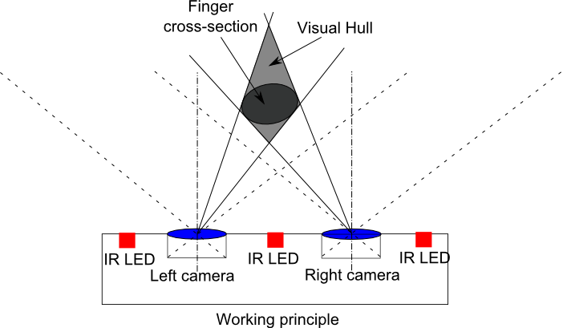

## 创意标题

搭配leap motion使用百度产品

## 创意简介

越来越多体感硬件设备进入了我们的视野当中，但总是觉得离自己很远，其实只是缺少接地气的产品。利用leap motion设备对手势识别的优势，同时也针对不同百度产品的特征与弱势，可以创造出新的交互方式，更便捷的使用百度的产品。

## 创意描述

### 创意背景（介绍一下创意期望解决的问题困扰，或者带来的额外好处。）

我的初衷很简单，既然体感设备，硬件设备趋于丰富和成熟，为什么不能让它们落地，让我们的产品，甚至我们的生活变得更好？

我一直相信科技绝不是什么高大上的玩意，我也相信、也愿意致力于让科技会让我们的生活变得更好。这也是为什么我喜欢体感设备的原因，这些设备能够让我们远离传统的鼠标和键盘，以更自由更舒适的方式操纵工具，让生活更便捷，更舒适，更好玩。

虽然体感设备层出不穷，技术趋于成熟，但大家似乎感觉都离自己很远。或许是因为渠道有限，又或许是价格高贵冷艳。但作为一个爱好者，既然我有资源，那么我乐于向大家分享这些新的技术，希望让大家看到一个科技在改变生活的未来，让大家明白，噢，原来科幻片里的场景真的已经离我们不远了。

参加这一次Hackathon，我没有打算从整体解决方案上对产品提出一些建议和改进，这次我只是站在一个工程师的角度，想利用科技来实现一些更友好的交互方式。使现有的产品使用起来更舒适。

### 解决方案（介绍一下具体的实施想法。如果是新产品创意，最好介绍一下用户增长路径和模式。）

1. 设备原理：

首先当然是利用leap motion这一个设备。设备的原理在这里简单介绍一下（与Kinect也类似）：设备通过发射红外，并通过接收
上方物体的折射回来的红外来判断物体的位置与状态，类似于雷达。

2. 如何实现设备与浏览器的通信

首先最重要的一点是leap motion提供Javascript的原生SDK，具体的通信原理可以如下图所示

1. 一旦你在PC上安装了leap motion设备的驱动和配套的程序，那么它会在本地启动一个webSocket服务(http://127.0.0.1:6437)，
在使用leap过程中产生的相关数据，都会转发给这一个服务

2. 当在网页上引入相关的SDK后，SDK便会尝试去和本地的WebSocket服务通信，接受实时的leap使用数据。

3. SDK以事件的方式广播所接受到的各类数据，那么我们要做的只是监听对应的事件以便拿到所需要的数据

3. 如何利用设备的实时数据操纵页面

1. 首先我需要整体出页面的对外API，比如可以通过哪一个接口或者方法向后翻页，通过哪一个接口或者方法下载图片

2. 同时自己实现了一个手势引擎，虽然SDK能够返回leap的实时数据，但是这些数据往往是最原始(raw)的，这些数据需要传递给手势引擎，
手势引擎又翻译为具体的手势。

3. 一旦引擎识别到了某一种手势，便触发对应的回调函数。而在手势对应的回调函数中调用页面的API，实现交互

4. 手势引擎如何识别手势

WebSocket服务是以帧(frame)为单位发送数据，每一帧的数据中包含此时此刻leap所能了解到的所有状态，有几只手，手掌的方向和位置，
手指的方位甚至每一个指关节的方位。一旦这些数据符合我们某个手势的特征，比如手掌向上，手指平摊，那么我们就认定触发了这一种手势

### 预期效果（大约的估计一下，该创意如果实施可以带来的期望收益值（如用户数，收入成长，成本降低等）。）

好吧，准确来说这并不是一类新的产品，无法从用户数，收入成长等方面来衡量。既然这一栏写的是效果，那么就不用预期了

直接上演示视频吧，此为使用leap motion控制百度图片的演示效果视频（其实我还想做音乐和地图来着，无奈精力有限）

优酷（百度内网可能会无法播放）：http://v.youku.com/v_show/id_XNzg0MDE5NTc2.html

土豆：http://www.tudou.com/programs/view/-tFqgn_FFMo/